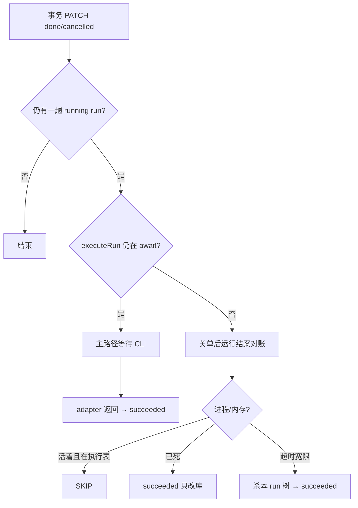

# 关单后运行结案对账（厚 · 定稿）

**上级薄总览：** [`../事务运行结束编排.md`](../事务运行结束编排.md)  
**状态：** 产品需求 + 技术细则 + 实现方针（2026-05-19）  
**代码现状：** `reconcileRunningRunsForClosedIssues`（`done` → `succeeded`；`cancelled` → `cancelRun`；执行中/子进程存活 → `skip`）。别名 `reconcileTerminalIssueRunningRuns` 保留兼容。

---

## 1. 环节定义

**何时进入本环节**

- 数据库：`heartbeat_runs.status = 'running'`
- 快照：`contextSnapshot.issueId` 非空
- 关联事务：`issues.status ∈ { done, cancelled }`

**本环节要做什么**

把「事务已在板上结案，但 run 仍显示进行中」收敛为 **控制面已结案**，并释放执行锁；**不**替代主路径上的「适配器自然返回」。

**本环节不做什么**

- 不处理「事务未完成但进程死了」（那是 **孤儿运行回收**，另文档）
- 不建 **滞留恢复单**（事务已终态时不应走 `reconcileStrandedAssignedIssues` 那套）
- 不检测「单 run 是否干了多笔事务」（产品认定主路径下不应存在）

---

## 2. 主路径 vs 本环节（对齐表）

| 阶段 | 谁动 | run 状态 | 进程 |
| --- | --- | --- | --- |
| 经办 PATCH `done` | issue API | 仍 `running` | CLI 通常仍在 |
| CLI 收尾退出 | 适配器 `execute` 返回 | → `succeeded`（executeRun） | 已退出 |
| **本环节** | 仅当上面卡住 | → **`succeeded`（目标）** | 已死则只改库；活着则 **跳过** |

**等待谁：** 主路径下控制面在 `executeRun` 里 **await 适配器**；本环节 **不抢跑** 正在 `activeRunExecutions` 或内存 `runningProcesses` 仍登记的 run。

---

## 3. 产品细则（定稿）

### 3.1 事务 `done`

- Issue 路由 **不** 因 `done` 调用 `cancelRun`（与 `cancelled` 不同）。
- 依赖方唤醒、父单唤醒等照常；**不**因此杀当前 run。

### 3.2 事务 `cancelled`

- 可 **立即** `cancelRun`（现有 `issues.ts` 行为）——用户意图是停止。

### 3.3 run 终态语义

| 场景 | run 终态 | 说明 |
| --- | --- | --- |
| 适配器正常返回 | `succeeded` / `failed` / `timed_out` | 现有 executeRun |
| 本环节兜底（事务已 done） | **`succeeded`** | 附固定结案说明，**非** `cancelled` |
| 本环节兜底（事务 cancelled 且仍 running） | 可 `cancelled` 或与取消路径合并 | 与「用户取消」一致 |

### 3.4 何时可杀进程

仅当 **同时**：

1. 确认是 **本 runId** 登记的 `processPid` / `processGroupId`（或内存句柄）；
2. 且（进程已死 **或** 超过产品级宽限仍活着、需强制收尾）。

**杀的范围：** 一趟 run **一棵进程树**（Windows `taskkill /F /T`；Unix 进程组），**不是**整机所有 CLI，**不是**同智能体其它 run（各 run 独立登记）。

**误杀防护：**

- `maxConcurrentRuns = 1` 时，同智能体通常只有一棵树；
- 对账 **禁止** 在 `activeRunExecutions.has(runId)` 为真时杀；
- 服务重启后仅有陈旧 PID 时：**优先只改库**，`isProcessAlive` 为假再收。

### 3.5 与并发

- 多 run 并发 = 多 **不同** 事务、多趟 run；**不是** 两趟 run 抢 `executionRunId`（claim 时锁：`executionRunId` 为空或已是本 run）。
- Routic 实践：`maxConcurrentRuns: 1`，降低「杀 A 误伤 B」概率。

---

## 4. 现状实现（便于 diff）

### 4.1 入口

- 函数：`reconcileTerminalIssueRunningRuns`（`heartbeat.ts`）
- 调用：`tickTimers` 开头（每次心跳 tick）
- 动作：`cancelRunInternal(runId, RUN_CANCEL_ISSUE_TERMINAL_WHILE_RUNNING)`
- 结果：run → **`cancelled`**，文案含「为对账已取消」

### 4.2 主路径（无需改语义，文档化即可）

- `executeRun`：阻塞至 `adapter.execute()` 结束 → `setRunStatus` → `releaseIssueExecutionAndPromote`
- 排队启动前：`claimQueuedRun` 内若事务已终态且无 resume 意图 → 排队 run 直接作废（stale）
- 适配器：`terminalResultCleanup`（`adapter-utils`）在见到 stream-json **result** 后 grace 再 SIGTERM 子树

### 4.3 相关常量

- `RUN_CANCEL_ISSUE_TERMINAL_WHILE_RUNNING`（`orchestration-invariants.ts`）——**待废弃或仅用于 cancelled 事务**

---

## 5. 目标实现（开发检查清单）

### 5.1 新函数（建议命名）

- `reconcileRunningRunsForClosedIssues` 或 `finalizeRunningRunsAfterIssueClosed`
- **不要**再调用 `cancelRunInternal` 处理 `done` 事务

### 5.2 单条 run 算法

```text
FOR each (run running, issue terminal):
  IF activeRunExecutions.has(run.id) OR runningProcesses.has(run.id):
    SKIP   // 主路径还在等优雅退出
  IF processPid/processGroupId 仍存活:
    SKIP   // 可选：仅当超过宽限才强制（见 5.4）
  ELSE:
    setRunStatus(succeeded, 结案说明)
    releaseIssueExecutionAndPromote
    // 不 SIGKILL 已死进程
```

### 5.3 强制收尾（可选第二阶段）

- 事务 `done` + 进程仍活 + 超过 `PAPERCLIP_*` 宽限（与 adapter grace 对齐或略大）
- `terminateHeartbeatRunProcess` **仅本 run 登记 PID**
- 仍标 **`succeeded`**，不是 cancelled

### 5.4 配置建议（环境变量，待实现时命名）

| 意图 | 建议 |
| --- | --- |
| 关闭孤儿回收抢跑 | `PAPERCLIP_ORPHAN_RUN_REAP_ENABLED=false` |
| 对账宽限秒数 | 新变量，默认 ≥ 适配器 `terminalResultCleanupGraceMs` |

### 5.5 测试

- 改：`server/src/__tests__/orchestration-heartbeat-guards.test.ts` 中 HB-010 用例 → 期望 `succeeded` + 跳过 living process
- 增：事务 done + mock 适配器未返回 → 对账不 cancel；进程死后 → succeeded

### 5.6 UI / 活动 / 台账

- 活动流勿展示「为对账已取消」
- run 徽章与 `finish_successful_run_handoff` 等逻辑：终态为 succeeded 时走成功链路

---

## 6. 与相邻环节边界



**孤儿回收 `reapOrphanedRuns`：** 不应在事务已 `done` 时把 run 标 `failed/process_lost` 并触发 **进程丢失重试 → 滞留 → 恢复单**；董事会倾向 **关闭或严格后置**。

---

## 7. 排障对照（白话）

| 现象 | 先查 | 结论方向 |
| --- | --- | --- |
| 事务 done，run 仍进行中，几秒后变取消 | 对账 + cancel 路径 | 应按本文改为 succeeded / 或 skip |
| 事务 done，run 很久才 succeeded | 主路径正常 | CLI 慢，非异常 |
| 活动里「为对账已取消」 | 旧 HB-010 | 改造后应消失 |
| 杀进程后别的 CLI 也没了 | 查是否同 PID 树 / 手搓 CLI 是否挂在同树 | 登记错误或非 Paperclip spawn |

API 取证顺序仍见 [`../../../最佳实践/004-实践-事务心跳与僵尸run排障.md`](../../../最佳实践/004-实践-事务心跳与僵尸run排障.md)。

---

## 8. 变更记录

| 日期 | 说明 |
| --- | --- |
| 2026-05-19 | 董事会讨论定稿：优雅退出优先、结案非取消、对账兜底、杀进程范围、并发语义 |

---

**上级：** [`../事务运行结束编排.md`](../事务运行结束编排.md)
