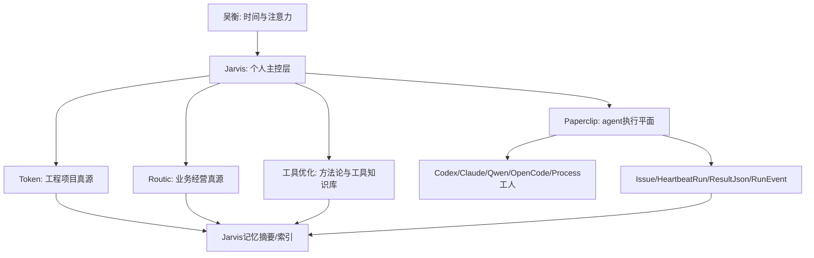

# 五仓定位（回形针 fork 侧工作口径）

> **与 Jarvis 的关系：** **正式「四仓 + Paperclip 执行面」真源**仍在 **Jarvis 仓库** `docs/00-分析/四仓定位.md`（与 `Jarvis与Routic顶层边界.md` 一致）。**本文不是**对那边文件的替换，而是 **本 Paperclip fork** 内采用的 **「五仓并列」** 口径，便于与 [`05 为何用回形针-编排链路与个人角色 2026-05-14.md`](05%20为何用回形针-编排链路与个人角色%202026-05-14.md) 等同目录文书对齐。两处若打架，**以你在 Jarvis 文书上的拍板为准**。

**返回：** [`长期需求/README.md`](README.md)

---

## 1. 结论

`jarvis`、`token-bridge-v2`、**Paperclip（回形针）**、`工具优化`、`routic` **五仓并列**，各守一块版图与真值边界。最易误判的两条仍写成**最短裁决**：

```text
Jarvis 管吴衡。
Paperclip 管一批 AI 工人。
Token / Routic / 工具优化 管各自领域真源（另两仓互不替代对方）。
```

这能避免两个常见误判：

- 把 Jarvis 下沉成另一个 issue / heartbeat / run ledger 系统。
- 把 Paperclip 上升成吴衡的个人主控层或个人操作系统入口。

## 2. 五仓划分

**记忆顺序：** 贾维斯 → Token → 回形针 → 工具优化 → Routic。

| 仓 | 仓库 / 目录（示例路径，随本机检出而变） | 层级 | 真源内容 | 不承担 |
| --- | --- | --- | --- | --- |
| **Jarvis** | `…/code/jarvis` | 用户级 / 系统层 | 个人主控、记忆基座、跨域索引、日报、画像、规则候选、调度判断 | 不接管 Token / Routic 原始真源；不重造 Paperclip 的 issue/run 细账 |
| **Token** | `…/token-bridge-v2` | 项目级 | Token 产品代码、工程文档、里程碑、任务单、部署、测试与验收证据 | 不保存通用工具方法论；不保存 Routic 经营资料长期原件 |
| **回形针** | **本仓库根**（Paperclip fork） | 公司级 / 项目级执行平面 | issue、agent、heartbeat、run ledger、usage、resultJson、session handoff、recovery | 不是 Jarvis；不决定吴衡今天该做什么；不保存其它四仓的长期资料真源 |
| **工具优化** | `…/工具优化` | 软件级 / 环境级 / 方法论 | AI 工具、模型分工、Agent 编排、记忆系统研究、硬件网络、规则、命令、skills 等可复用认知 | 不作为 Token 正式工程约束；不保存业务高敏原件 |
| **Routic** | `…/routic` | 业务域 / 公司级资料 | 公司主体、供应商、市场、运营、财务、客户、业务策略 | 不保存 Token 工程实现细节；不作为 AI 工具方法论真源 |

## 3. 软件级工具定位（工人层）

| 工具 | 定位 | 可用价值 | 边界 |
| --- | --- | --- | --- |
| Codex / Claude / Qwen / OpenCode | worker 或局部主脑运行时 | 执行具体任务、读写局部工作区、返回结果 | 不保存全局状态；不绕过 Paperclip/Jarvis 的上层裁决 |

## 4. 分层关系



## 5. 冲突裁决规则

| 问题 | 裁决 |
| --- | --- |
| 今天做什么、停什么、什么时候休息 | Jarvis 裁决，因为它站在用户级，保护吴衡的时间、健康和注意力 |
| 一个可拆分任务如何派给 AI 工人 | Paperclip 执行，因为它已有 issue、agent、heartbeat、run ledger 和 recovery |
| Token 项目状态看哪里 | `token-bridge-v2` 的项目文档、任务单、代码和验收证据 |
| Routic 经营资料看哪里 | `routic` 及其公司 / 供应商 / 财务 / 运营域 |
| AI 工具和编排方法看哪里 | `工具优化` |
| 长期跨域记忆看哪里 | Jarvis 的摘要、索引、source_path 和记忆产物 |
| 多 CLI 可视化和人工接管看哪里 | 当前不引入 Golutra；先用 Paperclip run log / UI 和 Codex 旁路指导 |

## 6. 自研协议与 Paperclip 映射

原先 `run.json` / `job.json` / `result.json` 是抽象协议，不必一比一自研落地。若采用 Paperclip 作为执行平面，优先映射到现有对象：

| 自研抽象 | Paperclip 对应 | 说明 |
| --- | --- | --- |
| `run.json` | `heartbeat_runs` + issue 当前状态 | 单次 agent 执行、状态、usage、session before/after、contextSnapshot、liveness |
| `messages/` | `heartbeat_run_events` + issue comments + activity | 事件流、日志元信息、生命周期、用户/agent 评论 |
| `job.json` | issue title / description / assignee / executionPolicy / contextSnapshot | 派单上下文由 issue 与 wake prompt 表达 |
| `result.json` | `heartbeat_runs.resultJson` + issue comment / work products | 机器可读结果在 resultJson；面向人类的收单在 comment 或 work product |
| `intermediate.json` | run log / transcript / stdoutExcerpt / logRef | 过程证据先留 Paperclip run log，Jarvis 只读摘要 |
| `context_status.json` | `usageJson` + `contextSnapshot` + session compaction policy | 官方 usage 可用于校准；本地估算仍可作为补充 |
| `controller_digest.md` | issue continuation summary / successful-run handoff / Jarvis 摘要 | 作为重启、交接、日报输入 |
| `open_decisions.json` | blocked issue / approval / tree hold / recovery issue | 需要人类或上级决策的显式状态 |
| `next_action.md` | issue next action / status / assigned recovery issue | 下一步不靠聊天历史，靠 issue 状态与 run metadata |

因此后续实现口径应改成：

```text
方法论保留 run/job/result 抽象；
落地优先复用 Paperclip Issue / HeartbeatRun / ResultJson；
只有 Paperclip 缺口才补薄适配层。
```

## 7. Paperclip 本地蜂群公司模板

第一版不追求“自治公司”，而是服务个人电脑上的可观察执行。

建议模板名：

```text
Routic 本地蜂群
```

它不是公司法务主体，只是 Paperclip 中的一套本机执行组织。真实公司主体仍以 `routic` 资料和公司级文档为准。

| Agent 名称 | 角色 | Adapter 建议 | 职责 | 禁止 |
| --- | --- | --- | --- | --- |
| Routic CEO | CEO / Coordinator | `codex_local` | 拆任务、创建子 issue、选择工人、收敛结果、决定继续/暂停 | 不直接吞下实现任务；不越过 Jarvis 决定今日主线 |
| Token Engineer | Engineer | `codex_local` / `opencode_local` / `claude_local` | Token 代码探查、实现、修复、测试 | 未授权不得改 `token-bridge-v2`；不得改经营资料 |
| Routic Researcher | Researcher | `codex_local` / `qwen` wrapper / `process` wrapper | 供应商、市场、运营、工具资料的只读研究与证据摘要 | 不把经营高敏原件复制进普通日志 |
| QA Reviewer | Reviewer / QA | `codex_local` / `process` | 验收、回归、typecheck、测试、风险检查 | 不把检查结果当成业务决策 |
| Memory Archivist | Archivist | `process` / 薄脚本 | 把 run summary、issue 结果整理成 Jarvis 可读摘要 | 不复制完整 transcript；不写回项目真源 |
| Human Handoff | Board / Manual | 人类 | 高风险决策、真实凭据、合同、财务、生产变更确认 | 不被自动 heartbeat 替代 |

默认 company 设置：

| 项 | 建议 |
| --- | --- |
| issue prefix | `RBC` 或后续按真实命名确定 |
| 默认工作区 | Paperclip 本地 workspace，不直接指向五仓各根目录混绑 |
| 默认预算 | 先为 0 或极低，按 agent 单独放开 |
| 新 agent 审批 | 本机试验可关闭；稳定后开启 |
| 默认语言 | 中文 UI + 英文机器字段保留 |

默认 issue 模板：

```text
目标：
边界：
允许读取：
允许写入：
禁止：
验收：
完成后必须：
- 写 issue comment
- 更新 issue 状态，或创建明确后续 issue
- 保留证据链接 / 路径
```

默认运行纪律：

- 每个 worker 完成后必须写 issue comment、更新 issue 状态或创建明确后续 issue；否则 Paperclip 会触发 recovery。
- CEO 只能通过 Paperclip issue/child issue 派工，不能在聊天里口头派单。
- 修改**五仓**任一方真源前，issue 须写清授权范围、写入路径和验收方式。
- 低风险探查可自动续跑；生产、财务、合同、密钥、供应商承诺、不可逆操作默认需要 Jarvis / 人类确认。

## 8. Jarvis 读取 Paperclip 的最小入口

Jarvis 不读取完整 run log 作为默认上下文，只读取摘要索引。

最小摘要对象：

```json
{
  "source": "paperclip",
  "company_id": "xxx",
  "issue_id": "xxx",
  "issue_identifier": "LOC-5",
  "issue_title": "POC retry: Codex CEO delegates to process worker",
  "issue_status": "done",
  "agent_id": "xxx",
  "agent_name": "Codex CEO POC",
  "run_id": "xxx",
  "run_status": "succeeded",
  "summary": "Created one child issue and closed parent.",
  "usage": {
    "input_tokens": null,
    "output_tokens": null,
    "cost_usd": null
  },
  "risk": "low",
  "next_action": null,
  "source_path": "paperclip://company/issue/run"
}
```

Jarvis 侧处理规则：

1. 只把 `summary`、状态、成本、失败原因、下一步、source 指针进入日报或记忆索引。
2. 完整 `stdout`、`stderr`、`resultJson`、run log 只在排障时按需读取。
3. Paperclip 的 issue 状态不回写 Token / Routic / 工具优化；需要回填时由 Jarvis 生成“待人类确认的回填建议”。
4. Jarvis 的今日主线可以引用 Paperclip 状态，但不能被 Paperclip 的高频 recovery / heartbeat 牵着走。

## 9. Golutra 排除原则

Golutra 不再作为当前候选路线。

排除原因：

- Paperclip 已经承担当前主执行器角色，继续评估 Golutra 会稀释路线。
- 当前真正冲突是 **五仓** 资产分层与 skills 组织方式，不是 CLI 工作台选择。
- 终端可视化和人工注入不是当前 P0；需要时以后另开专题，不放进本轮「回形针侧」定位叙述。

## 10. 后续落地顺序

1. 先让 Jarvis 承认 Paperclip 是执行平面，而不是竞争主控。
2. 用 Paperclip 做一个固定本地蜂群公司模板。
3. 把 `run/job/result` 文档改成抽象协议，并补 Paperclip 映射。
4. 做 Jarvis 的 Paperclip 摘要读取脚本或手工导入格式。
5. 浏览器验收 Paperclip 执行链路；Golutra 不进入当前路线。

---

## 修改记录

| 日期 | 摘要 |
| --- | --- |
| 2026-05-15 | 初版：**自 Jarvis 迁出的「五仓并列」稿**落盘本 fork；Jarvis `四仓定位.md` 保持原状 |
